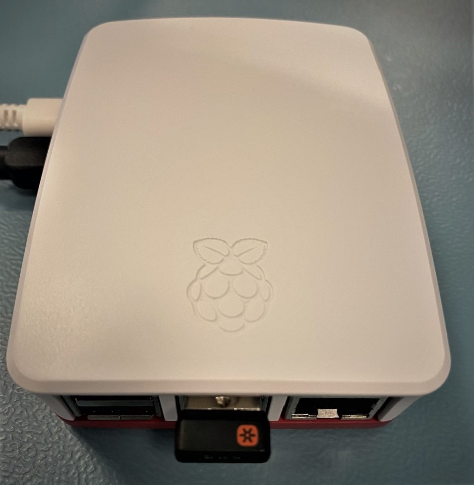
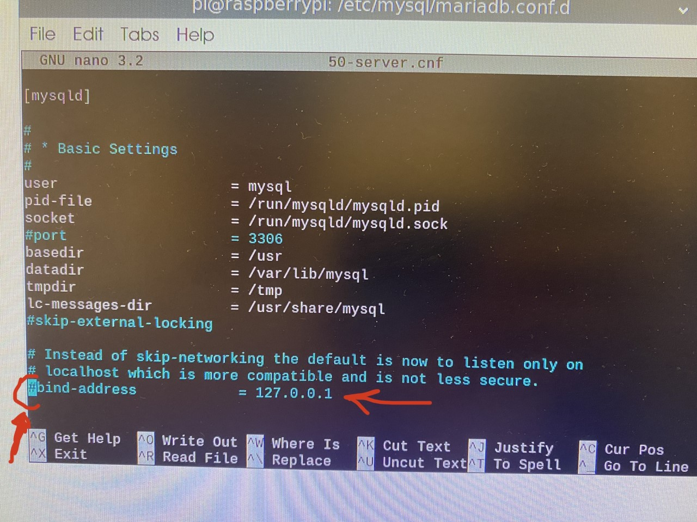
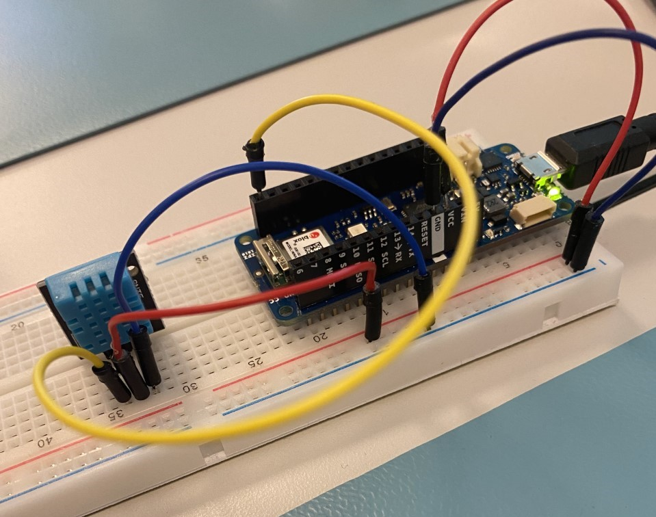
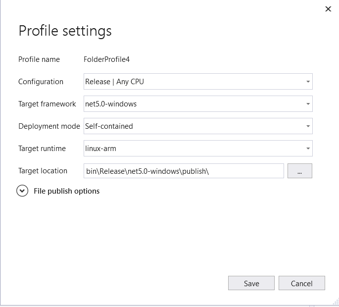
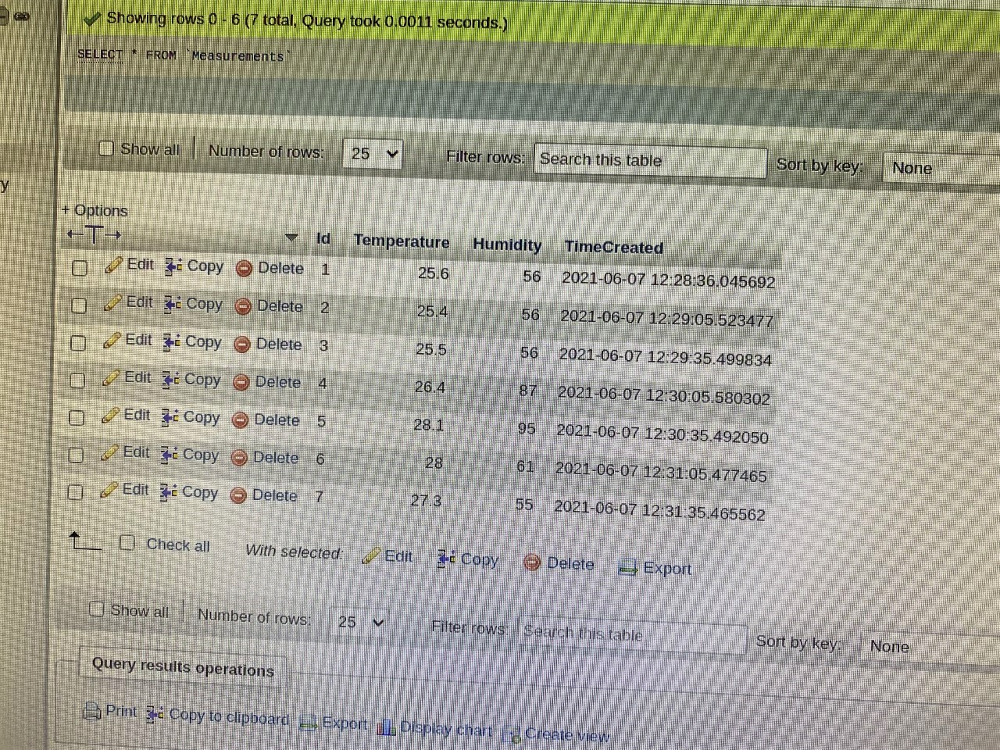

# MQTT Broker Server



**Indholdsfortegnelse:**

* **General beskrivelse**
  * *Dette afsnit beskriver overordnet om projektet, så man får en forståelse for hvad projektet handler om og hvad projektet tager udgangspunkt i.*
* **Opsætning af eksempel projektet (SimpleMqttServer)**
  * *Dette forklare hvordan man starter ud med [SimpleMqttServer](https://github.com/SeppPenner/SimpleMqttServer) projektet og gør så det kan fungere på ens Raspberry Pi, med Raspberry Pi styresystemet.*
* **Opsætning af Raspberry Pi**
  * *Dette afsnit beskriver hvordan vi har opsat nogle af de forskellige ting på vores Raspberry Pi*
  * **Opsætning af hostname** 
  * **Opsætning af remote** 
* **Stage 1 demo**
  * *Dette afsnit viser og beskriver hvad vi fik til at virke i første del af opgaven. Blandt andet publish af MQTT Broker projektet og opsætningen af dette på Raspberry Pi'en*
* **Stage 2 demo**
  * *Dette afsnit viser og beskriver hvad vi fik til at virke i anden del af opgaven. Blandt andet at det embedded board kan publish temperatur og luftfugtigheds dataen op til MQTT Broker serveren og at den så ligger det ind i MariaDB databasen*
 

&nbsp;&nbsp;

## General beskrivelse
Projektet handler om at lave en MQTT Broker server, som er lavet i .NET kode. MQTT Broker serveren kan smide den modtagende data over i en database og dertil skal der lave en WebAPI, som kan hente dataen fra databasen.
MQTT Brokeren vil modtage temperatur og luftfugtigheds data fra et MKR WIFI1010 board og det vil så blive muligt at hente dataen ned på en client (Web/Mobile), ved at kalde WebAPI'et.

Dette projekt er blevet hosted på en Raspberry Pi og her er det vigtigt at have installeret .NET runtime på Raspberry Pi'en. I vores tilfælde valgte vi .NET 5.0.x

&nbsp;

Projektet tager udgangspunkt i følgende eksempel projekt: [SimpleMqttServer](https://github.com/SeppPenner/SimpleMqttServer)

SimpleMqttServer projektet bruger følgende MQTTnet nugets:
* MQTTnet
* MQTTnet.Protocol
* MQTTnet.Server

Disse nugets er fra følgende git projekt: [MQTTnet](https://github.com/chkr1011/MQTTnet)

&nbsp;

## Opsætning af eksempel projektet (SimpleMqttServer)

Eksempel projektet blev brugt på en Raspberry Pi, men da vi havde koden lagt over og vi derefter prøvede at publish koden på Raspberry Pi'en, så løb vi ind i en masse problemer.
I stedet for så valgte vi at publish koden til en folder, fra en anden computer af og så bagefter overføre den published mappe til Raspberry Pi'en, via et eksternt drev.

Her er det dog vigtigt at man f.eks ændre filepath'en, så den passer med den destination hvor koden skal køres, da den kode som var lavet i eksempel projektet, gør så når man publisher, så tager den filstien, til den computer som er published fra og det vil derfor ikke virke, når man smider den published kode over på en anden computer.

Det der skal ændres er pathen, som er efter "=" tegnet i currentPath variablen, som er inde i Main. Koden kan ses på kodeeksemplet under.
Den øverste udkommenterede koden er fra eksempel projektet og det under er det nuværende kode, som er brugt.
Grunden til at der er / imellem er fordi, at det her skal ligge på Raspberry Pi styresystem

```csharp
public static void Main()
{
	//var currentPath = Path.GetDirectoryName(Assembly.GetExecutingAssembly().Location);
	var currentPath = "/home/pi/Desktop/SimpleMQTTServer/SimpleMqttServer-master/src/SimpleMqttServer";

...
```

Nu skal path'en i filePath variablen også ændres, som er i ReadConfiguration metoden, med mindre der bruges Windows, så kan der bare bruges den del af eksempel koden.
Her er brugt Raspberry Pi styresystem, så der skal ændres \\ til / istedet for.

```csharp
private static Config ReadConfiguration(string currentPath)
{
	//var filePath = $"{currentPath}\\config.json";
	var filePath = $"{currentPath}/config.json";

...
```

&nbsp;

## Opsætning af Raspberry Pi

Følgende er blevet gjort på Raspberry Pi'en:
* Installeret .NET 5.0 Runtime
* Opsætning af hostname
* Installeret MariaDB
* Konfigureret MariaDB til at kunne remote(til EF Core Migration og Update Database fra anden pc)
* Opsætning af firewall
* Konfigureret en bruger på MariaDB


### Opsætning af hostname

Vi har ændret hostname på Raspberry Pi'en, da de andre gruppers Raspberry Pi højst sandsynligt også havde samme hostname ("raspberrypi") og var koblet på samme Access Point. 

Dette kunne muligtvis give problemer, hvis man prøvede at connecte til MQTT Broker Serveren, via hostnamet

Guide til ændring af hostname: [Link](https://blog.jongallant.com/2017/11/raspberrypi-change-hostname/)


### Opsætning af firewall

Først tjekkes der lige om ufw firewall allerede er installeret, hvis ikke, så installer det.

Dette kan gøres ved at følge følgende guide: [Link](https://dev.to/delightfullynerdy/bash-ufw-command-not-found-ubuntu-18-04-1agh)

Når alt dette er gjort, så skal IP'en på den computer der vil add-migration og update database fra, tilføjes til allow listen på firewall'en.

For at tilføje en IP, som skal allowes på firewall'en, så skal der skrives følgende i terminal (ændre IP'en til den der skal allowes):
```shell
sudo ufw allow from 192.168.42.15 to any port 3306
```

Skriv derefter følgende, for at reload:
```shell
sudo ufw reload
```

&nbsp;

Husk også at allow IP'en på den embedded board (MKR WIFI 1010)

Dette gjorde vi på følgende måde
```shell
sudo ufw allow from 192.168.42.20
```

Skriv derefter følgende, for at reload:
```shell
sudo ufw reload
```


### Opsætning af remote

For at kunne add-migration og update database, til vores MariaDB database på Raspberry Pi'en, fra vores solution på windows PC'en, så skal der kunne connectes remote til MariaDB serveren og ikke kun via localhost.

Her skal der så lige sættes nogle ting op på Raspberry Pi'en, hvor MariaDB serveren køre.

Når MariaDB serveren er blevet installeret, så skal der gøres følgende:

Åben terminal og skriv:
```shell
cd /etc/mysql/mariadb.conf.d
```

Skriv derefter:

```shell
sudo nano 50-server.cnf
```

Udkommenter nu den linje vist med pilen på billedet under. Dette gøres ved at tilføje # foran "bind-address"




Nu skal der så restartes for MySQL/MariaDB serveren. Det gøres ved at skrive følgende:

```shell
sudo service mysqld stop
```

Skriv derefter:

```shell
sudo service mysqld start
```

Nu skulle MySQL/MariaDB serveren være oppe at køre igen.
Se eventuelt billedet under, markeret med rød boks og se bort fra alt andet der sker på screenshottet.


&nbsp;

## Opsætning af embedded boardet

Det embedded board vi bruger er et MKR WIFI 1010.
Det er koblet til samme access point, som vores Raspberry Pi og vi har lavet projektet ved hjælp af Platform IO til Visual Studio Code.

Projektet har følgende libraries:
* WiFiNINA
* MQTT
* DHT
* Adafruit_Sensor
* Wire
* SPI

Projektet bruger følgende perifære enheder:
* DHT11 (Temperature & Himidity sensor)

&nbsp;

Her er linket til embedded projektet på GitHub: [EmbeddedMQTT](https://github.com/nitram1337/EmbeddedMQTT)

&nbsp;

Under ses billedet af boardet og DHT11'eren, som er koblet på og hvordan det er koblet til.




&nbsp;

## Stage 1 demo

I første stage har vi fået sat MQTT broker serveren projektet op og gjort så den kører på Raspberry Pi'en.
Her var det vigtigt at have installeret .NET runtime på Raspberry Pi'en. Vi brugte følgende version: .NET 5.0.
Derefter publish'ede vi projektet på den computer hvor vi programmerede på (Windows 10 pc) og under publish valgte vi publish til folder og med følgende, som er set på billedet under

**Folder Publish Profile Settings:**



&nbsp;

Efter vi havde published til folder på Windows 10 maskinen, så tog vi et eksternt drev og flyttede den published folder fra Windows 10 pc'en og over på Raspberry Pi'en.
Derefter brugte vi følgende kommando i terminalen på Raspberry Pi

Gå ind i det published projekts mappe, som i vores tilfælde ligger på Desktop

cd /home/{BrugerNavn}/Desktop/{Navn på published projekt mappen, som ligger på desktop}
```shell
cd /home/pi/Desktop/MQTTBroker
```

For at køre den published kode har vi skrevet følgende:
```shell
dotnet SimpleMqttServer.dll
```

På billedet under kan ses vores MQTT Broker server, som er kørt via terminalen.
Her kan også ses at der bliver published 2 beskeder til brokeren.

**MQTT Broker server kørende på Raspberry Pi:**


&nbsp;

På billedet under kan der ses MQTTX som kører på en Windows 10 maskine og som publisher et 2 tal op til vores MQTT Broker server, som kører på Raspberry Pi'en og derefter får vores MQTT Client 2 tallet tilbage igen, da den også Subscriber på den samme Topic, som der blev Published til.
Billedet under passer ikke med det over, i forhold til at det der bliver sendt op ikke er det samme, som der står der er modtaget på billedet over - det er pga. at billederne er taget på forskellige tidspunkter.

**MQTT Client på anden pc, som bruger MQTT Broker serveren:**


&nbsp;

## Stage 2 demo

I andet stage har vi koblet det embedded MKR WIFI 1010 board til og skrevet koden, så den kan sende op til vores egen MQTT Broker server.

Vi har også skrevet lidt om i koden til MQTT Broker serveren og tilføjet nogle ting, så nu når MQTT Broker Serveren modtager en publish fra Topic'en measurements, så smider den det over i MariaDB databasen.

Under kan der ses vores MQTT Broker server, som kører på vores Raspberry Pi. Her kan der ses at en ny client connecter og her kan også ses at en ny message bliver published op til vores MQTT Broker server.


På billedet under kan man se en udskrift til terminalen af det, som der også bliver published op til vores MQTT Broker.


På billedet under kan man se, at værdierne bliver lagt ind i vores MariaDB database, som blev sendt fra vores MKR WIFI 1010 board, via MQTT.




