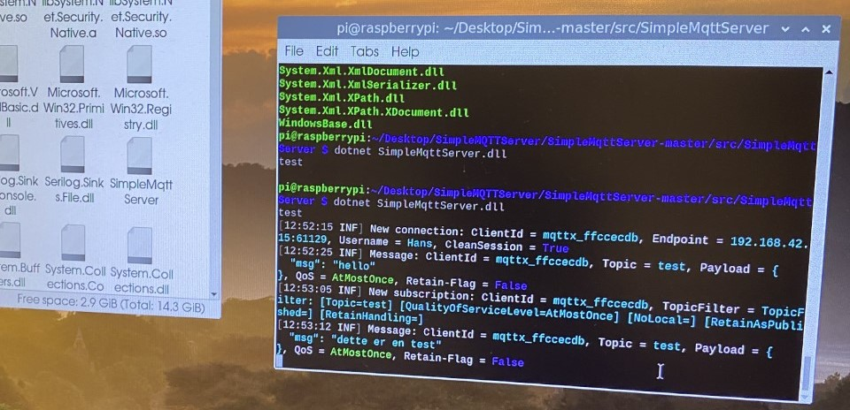

# MQTT Broker Server

**Indholdsfortegnelse:**

* General beskrivelse
  * Dette afsnit beskriver overordnet om projektet, så man får en forståelse for hvad projektet handler om og hvad projektet tager udgangspunkt i.
* Opsætning af eksempel projektet (SimpleMqttServer)
  * Dette forklare hvordan man starter ud med [SimpleMqttServer](https://github.com/SeppPenner/SimpleMqttServer) projektet og gør så det kan fungere på ens Raspberry Pi, med Raspberry Pi styresystemet.
* Stage 1 demo
  * Viser og beskriver hvad vi fik til at virke i første del af opgaven.

&nbsp;&nbsp;

## General beskrivelse
Projektet handler om at lave en MQTT Broker server, som er lavet i .NET kode. MQTT Broker serveren kan smide den modtagende data over i en database og dertil skal der lave en WebAPI, som kan hente dataen fra databasen.
MQTT Brokeren vil modtage temperatur og luftfugtigheds data fra et MKR WIFI1010 board og det vil så blive muligt at hente dataen ned på en client (Web/Mobile), ved at kalde WebAPI'et.

Dette projekt er blevet hosted på en Raspberry Pi og her er det vigtigt at have installeret .NET runtime på Raspberry Pi'en. I vores tilfælde valgte vi .NET 5.0.x

&nbsp;

Projektet tager udgangspunkt i følgende eksempel projekt: [SimpleMqttServer](https://github.com/SeppPenner/SimpleMqttServer)

SimpleMqttServer projektet bruger følgende MQTTnet nugets:
* MQTTnet
* MQTTnet.Protocol
* MQTTnet.Server

Disse nugets er fra følgende git projekt: [MQTTnet](https://github.com/chkr1011/MQTTnet)

&nbsp;

## Opsætning af eksempel projektet (SimpleMqttServer)

Eksempel projektet blev brugt på en Raspberry Pi, men da vi havde koden lagt over og vi derefter prøvede at publish koden på Raspberry Pi'en, så løb vi ind i en masse problemer.
I stedet for så valgte vi at publish koden til en folder, fra en anden computer af og så bagefter overføre den published mappe til Raspberry Pi'en, via et eksternt drev.

Her er det dog vigtigt at man f.eks ændre filepath'en, så den passer med den destination hvor koden skal køres, da den kode som var lavet i eksempel projektet, gør så når man publisher, så tager den filstien, til den computer som er published fra og det vil derfor ikke virke, når man smider den published kode over på en anden computer.

Det der skal ændres er pathen, som er efter "=" tegnet i currentPath variablen, som er inde i Main. Koden kan ses på kodeeksemplet under.
Den øverste udkommenterede koden er fra eksempel projektet og det under er det nuværende kode, som er brugt.
Grunden til at der er / imellem er fordi, at det her skal ligge på Raspberry Pi styresystem

```csharp
public static void Main()
{
	//var currentPath = Path.GetDirectoryName(Assembly.GetExecutingAssembly().Location);
	var currentPath = "/home/pi/Desktop/SimpleMQTTServer/SimpleMqttServer-master/src/SimpleMqttServer";

...
```

Nu skal path'en i filePath variablen også ændres, som er i ReadConfiguration metoden, med mindre der bruges Windows, så kan der bare bruges den del af eksempel koden.
Her er brugt Raspberry Pi styresystem, så der skal ændres \\ til / istedet for.

```csharp
private static Config ReadConfiguration(string currentPath)
{
	//var filePath = $"{currentPath}\\config.json";
	var filePath = $"{currentPath}/config.json";

...
```

&nbsp;

## Stage 1 demo

I første stage har vi fået sat MQTT broker serveren projektet op og gjort så den kører på Raspberry Pi'en.
Her var det vigtigt at have installeret .NET runtime på Raspberry Pi'en. Vi brugte følgende version: .NET 5.0.
Derefter publish'ede vi projektet på den computer hvor vi programmerede på (Windows 10 pc) og under publish valgte vi publish til folder og med følgende, som er set på billedet under




